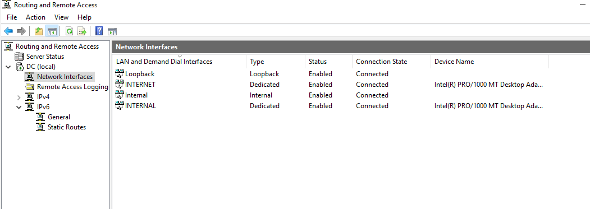
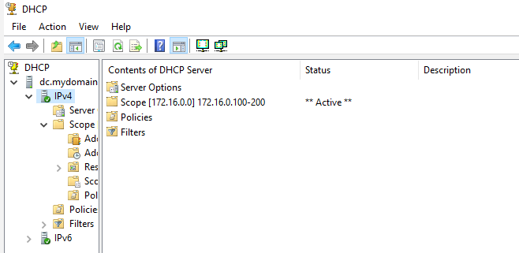
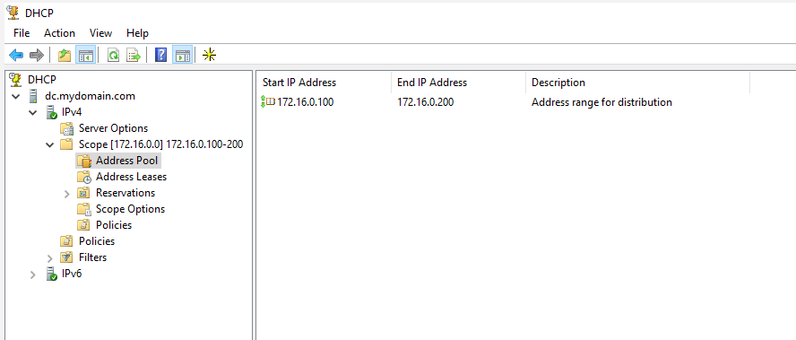
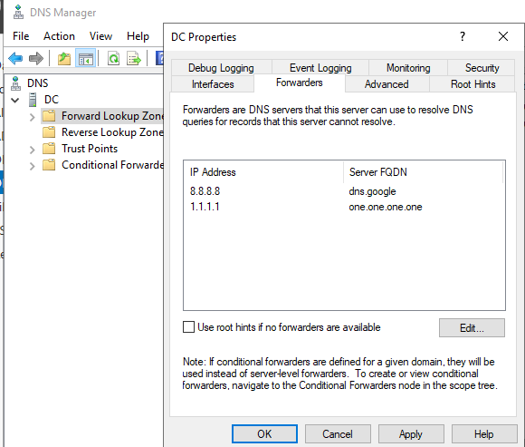
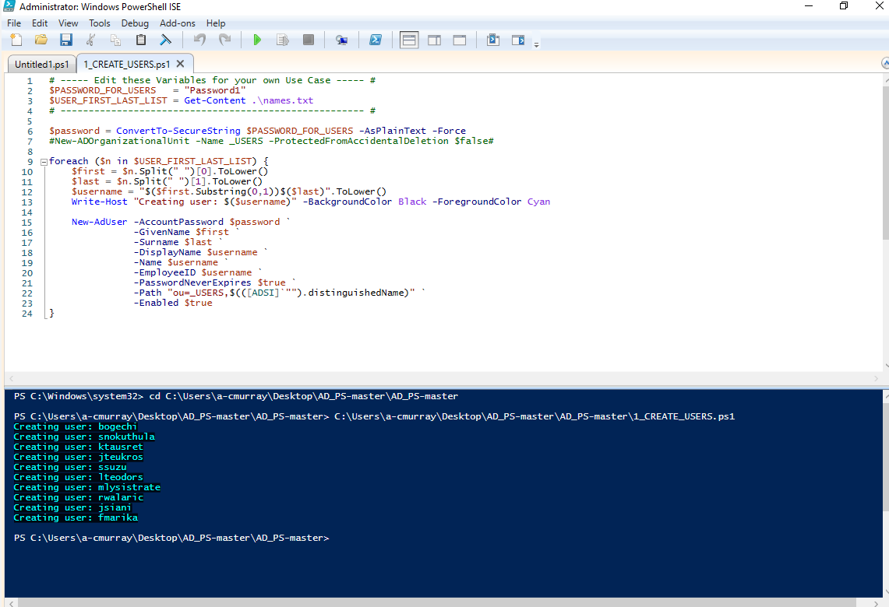

# Active Directory Home Lab

**Author:** C-P-M Support  
**Target Roles:** Tier 1 IT Support / Help Desk Specialist / Systems Administrator  

---

## 📌 Project Overview
Deployed an isolated, dual-adapter virtual network using Oracle VM VirtualBox to simulate an enterprise Active Directory environment. Configured a Windows Server 2019 Domain Controller with Routing and Remote Access Services (RRAS) NAT to route internet traffic to internal client machines, established DHCP for dynamic IP assignment, set up DNS forwarders, and executed a custom PowerShell script to bulk-provision domain users.

---

## 📐 Architecture & Network Specifications

| Component | Detail / Configuration |
| :--- | :--- |
| **Virtualization** | Oracle VM VirtualBox |
| **Domain Controller (DC)** | Windows Server 2019 (`mydomain.com`) |
| **Client Workstation** | Windows 10 (`CLIENT1`) |
| **NIC 1 (DC)** | Host Internet-Facing Interface (`INTERNET`) |
| **NIC 2 (DC)** | Private Internal Segment (`172.16.0.1` - Static Gateway / DNS) |
| **Client NIC** | Internal Network (Dynamic IP via DC DHCP) |
| **DHCP Pool** | Scope `172.16.0.100` – `172.16.0.200` (`255.255.255.0`) |
| **Routing & DNS** | RRAS NAT / Public DNS Forwarders (`8.8.8.8`, `1.1.1.1`) |

---

## 🛠️ Configurations Completed

### 1. Network Routing & Core Infrastructure
* Provisioned dual network interface cards (NICs) on the Domain Controller to create an isolated internal network while maintaining external internet access through NAT.
  

* Established a dedicated **DHCP Scope** (`172.16.0.100` – `172.16.0.200`) to automatically distribute IP addressing, gateway pointers, and DNS settings.
  
  

* Configured **DNS Upstream Forwarders** (`8.8.8.8` and `1.1.1.1`) to handle external name resolution for internal domain clients.
  

---

### 2. Active Directory Services & Automation
* Promoted server to primary Domain Controller and initialized the domain (`mydomain.com`).
* Designed Organizational Unit (OU) structures (`ou=_USERS`) to isolate created user accounts.
* **PowerShell Automation:** Developed and executed an automated PowerShell script to ingest user data from a text list, dynamically format usernames/passwords, and bulk-create user accounts in Active Directory.



```powershell
# Core script used for bulk AD user ingestion
$PASSWORD_FOR_USERS = "Password1"
$USER_FIRST_LAST_LIST = Get-Content .\names.txt

$password = ConvertTo-SecureString$PASSWORD_FOR_USERS -AsPlainText -Force
New-ADOrganizationalUnit -Name _USERS -ProtectedFromAccidentalDeletion $false

foreach ($n in$USER_FIRST_LAST_LIST) {
    $first =$n.Split(" ")[0].ToLower()
    $last =$n.Split(" ")[1].ToLower()
    $username = "$($first.Substring(0,1))$($last)".ToLower()
    Write-Host "Creating user: $($username)" -BackgroundColor Black -ForegroundColor Cyan

    New-ADUser -AccountPassword $password `
               -GivenName $first `
               -Surname $last `
               -DisplayName $username `
               -Name $username `
               -EmployeeID $username `
               -PasswordNeverExpires $true `
               -Path "ou=_USERS,$(([ADSI]'').distinguishedName)" `
               -Enabled $true
}
